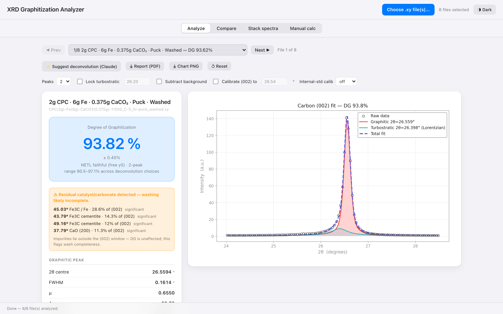
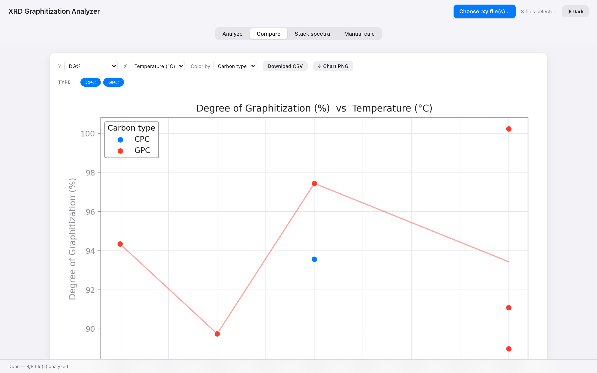
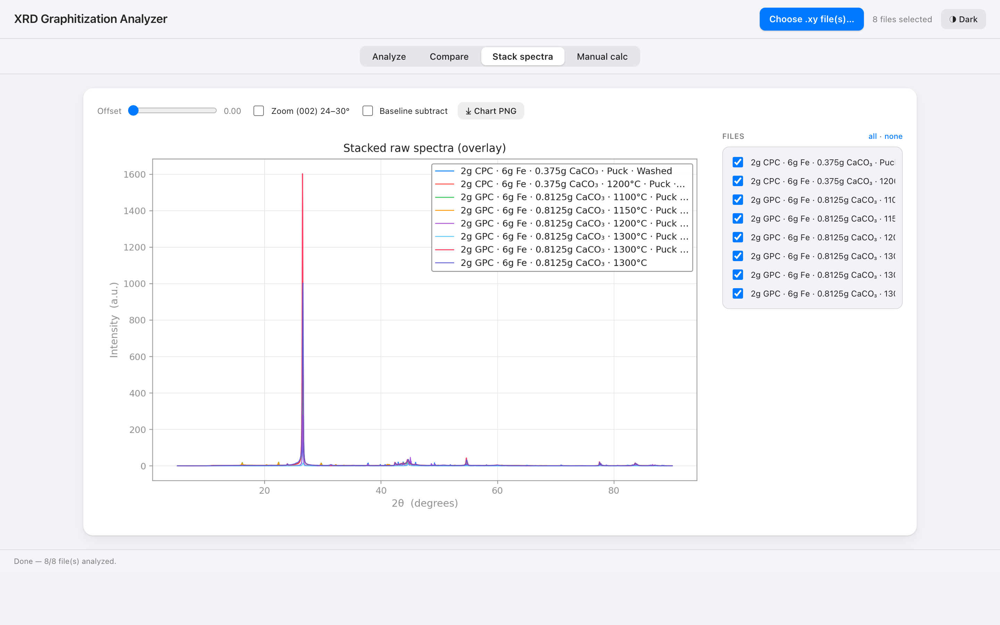

# XRD Degree of Graphitization Analyzer

Computes the **Degree of Graphitization (DG%)** of synthetic graphite from X-ray
diffraction `.xy` files — a reproducible, validated implementation of the **NETL
method** (PsdVoigt1 deconvolution of the carbon (002) reflection → Bragg
d-spacings → area-weighted d′ → Maire–Mering) for the TAMU / NETL / Oxbow
ARPA-E "graphite from petroleum coke" project.

**Why it exists.** The standard workflow is a slow, analyst-dependent OriginLab
peak-fit, one sample at a time. This tool standardizes it: the same math every
time, batch processing, and the one genuinely human judgment — how to deconvolve
the (002) shoulder — made explicit (and optionally AI-assisted), while the DG
number is always computed deterministically.

## Screenshots

**Analyze** — per-file (002) deconvolution with DG ± σ, a defensible range, live
fit plot, and a residual-phase quality flag:



**Compare** — any metric vs synthesis parameter, grouped/colored, with trend lines:



**Stack spectra** — overlay/waterfall of raw intensities to compare peak heights:



*(Shown: the web app. The native macOS app has the same four tabs and controls.)*

## Three front-ends, one engine

| Surface | For | Notes |
|---|---|---|
| **CLI** ([xrd_analyzer.py](xrd_analyzer.py)) | scripting, batch, CI | single file / directory → table, JSON, CSV |
| **Web app** ([xrd_webgui.py](xrd_webgui.py), Docker) | the lab / a shared server | Analyze · Compare · Stack · Manual; runs on your host |
| **Native macOS app** ([native/](native/), Swift) | desktop, offline | interactive deconvolution, native charts, pure-Swift engine, bundled local AI |

**Validated against the postdoc's OriginLab gold standard** (mean abs error):
expert hand-placement **0.43%**, AI-assisted **~0.9–1.0%** (Claude / local
gemma3:4b), fully-automatic **1.16%** — all within the deconvolution's own
uncertainty. The fit math is identical across the Python and Swift engines.

**AI deconvolution assist (optional).** The assist proposes the deconvolution
setup from *derived numeric features* (not raw data); the human confirms; DG is
always computed locally by the deterministic engine. The two builds differ only
in where inference runs: the **web/Docker app uses the Anthropic Claude API** (so
the server stays a thin tier — ideal for low-power hosts), while the **native
desktop app uses a bundled local model** (gemma3:4b) that needs no setup, no key,
and never leaves the machine. Cu Kα λ = 1.54187 Å throughout.

---

The original CLI ships **one standard automatic pipeline** (no options) for
single-file + batch use; the apps add the interactive / AI-assisted workflow.

## The standard pipeline

1. Linear baseline subtraction over the (002) window **24°–27.5°** (this isolates
   the (002) complex and excludes extraneous-phase peaks, e.g. calcite ~29.4°).
2. Fit a graphitic **Pseudo-Voigt** + a **pure-Lorentzian turbostratic** peak
   (`μ = 1`, the NETL convention; turbostratic `xc ≤ 26.1°`, graphitic
   `xc ∈ [26.3, 26.8]`).
3. Bragg d-spacings, area fractions, area-weighted `d′`, and the **Maire–Mering**
   DG%. Crystallite height **Lc = 0.89·λ / (B·cos(θ/2))** from the graphitic FWHM.

The NETL fit window's right edge is trimmed to **28.5°** so residual calcite
CaCO₃ (104) (~29.4–29.7°) in carbonate-heavy/unwashed samples can never intrude
(that region is pure (002) baseline, so DG is unchanged — verified < 0.15° shift).
A **data-quality scan** also runs over the *full* pattern and flags catalyst /
carbonate residue (Fe, Fe₃C, CaO, calcite) by phase and intensity relative to the
(002) — these all lie outside the fit window, so they never affect DG, but the
flag tells you whether acid washing was complete (mirrored in web + desktop apps).

**Specimen-displacement calibration (optional).** A misaligned sample (off the
Bragg–Brentano focusing circle) shifts every peak by Δ2θ ≈ −(2s/R)·cosθ, biasing
d-spacing and DG. Anchor the measured (002) to its known position (e.g. 26.54°)
and the whole pattern is shifted by that constant offset before fitting; the
applied Δ2θ is reported so the correction is transparent and reproducible
(`fit_netl(..., anchor_002=26.54)` / desktop "Calibrate (002) position" toggle).
Anchoring assumes a well-ordered graphitic phase — an internal standard is the
rigorous alternative (below).

**Internal-standard calibration (rigorous).** When the scan contains residual
crystalline phases (Fe₃C, α-Fe, CaO from incomplete washing), their lattice-fixed
reflections are a built-in 2θ reference. `calibrate_internal_standard()` indexes a
chosen phase (or `auto`), matches its lines to observed peaks, and — only if they
agree on one offset (tight spread) **above a ~0.05° lattice-uncertainty floor** —
reports a *significant* shift to apply. Validated: it leaves the (well-aligned)
postdoc gold samples untouched (MAE 0.96% → 0.96%, sub-floor offsets ignored)
while recovering a real +0.05–0.09° shift on miscalibrated runs (turning
unphysical DG >100% into a sensible ~92–96%). The AI assist consumes this too —
when a reliable internal standard is present the 2θ is calibrated before the model
sees the features, so it no longer has to guess displacement. Mirrored in web +
desktop; the offset is reported either way. DG is computed locally throughout.

**DG uncertainty + range.** Every fit reports a statistical 1σ from the fit
covariance (`DG_sigma`), and — more importantly — a **range across the defensible
deconvolution choices** (2-peak free, 1-peak, 2-peak low-turbostratic) via
`dg_range()`. Since the dominant DG uncertainty is the deconvolution *choice*, not
the fit, this makes the non-uniqueness explicit: on the two postdoc samples where
least-squares and the expert disagree, the reported range *brackets* the gold
value. Shown as "DG ± σ (range a–b%)" in both apps.

**Per-sample report.** The web app exports a one-page **PDF** (fit plot +
parameters + QC + calibration + DG ± σ + range); the desktop app exports the same
as **CSV**.

**Tests.** `python3 -m pytest tests/` — synthetic math + uncertainty/range checks
run anywhere; gold-data MAE (≤ 1.1% vs the postdoc fits), calibration-silence on
aligned samples, and Python↔Swift engine parity run locally and skip cleanly in CI
when the data/Swift binary aren't present. CI runs the synthetic suite on every push.

Validated against the NETL/postdoc OriginLab fits: mean abs error ≈ 1.3 DG% across
the GPC/CPC sample set. X-ray wavelength is fixed to Cu Kα **λ = 1.54187 Å**.
`OptimizeWarning` / fit failures are caught and reported cleanly.

Dependencies: `numpy`, `scipy`, `matplotlib`.

## CLI

```bash
python3 xrd_analyzer.py sample.xy
python3 xrd_analyzer.py sample.xy --json

# Batch (multiple files / a directory) → table, JSON array, or CSV
python3 xrd_analyzer.py *.xy --csv results.csv
python3 xrd_analyzer.py data_dir/ --json
```

`--json` emits a strict JSON object (one file) or array (batch) with the fitted
parameters (`xc`, `w`, `mu`, `A`), d-spacings, `fit_r2`, Lc and DG%.

**Manual peak entry** (the NETL "prompt excel sheet") — compute DG directly from
Origin fit values, no file/fit (use this to reproduce a specific hand-fit exactly):

```bash
python3 xrd_analyzer.py --peaks 26.51:20.571,26.181:8.062   # two peaks → 76.7%
python3 xrd_analyzer.py --peaks 26.506:329.83               # one peak  → 89.8%
```

## Web GUI

```bash
python3 xrd_webgui.py            # serves http://127.0.0.1:8000
python3 xrd_webgui.py --port 8642
```

**One page, one shared upload, four tabs.** Choose `.xy` file(s) once in the
header — analysis runs automatically and the same files feed every tab (the
switch is seamless, no re-upload). The server honours `$PORT`/`$HOST` (binds
`0.0.0.0` when `$PORT` is set), so it runs unchanged on container hosts.

- **Analyze** — per-file NETL fit with a high-resolution plot (raw points +
  deconvolved peaks) and a **manual control panel at parity with the desktop app**:
  peak count (1/2), lock turbostratic, subtract background, and **(002)
  displacement calibration** — plus the AI **Suggest** button, which fills those
  controls from its decision (and can flag a displacement shift). Page through
  files with the run selector.
- **Compare** — parsed-parameter table + **one** comparison chart. Pick X / Y /
  colour-by, then add or remove points with **per-group and per-run checkboxes**
  (e.g. hide a whole carbon type or a single outlier run). The trend line follows
  the mean at each X value so replicates don't zig-zag. Download CSV.
- **Stack spectra** — overlay the raw intensities of any checked files on one
  plot to compare **peak heights**. An **offset slider** goes from a flat overlay
  (0) to a waterfall; optional (002) zoom and linear baseline subtraction.
- **Manual calc** — enter 1 or 2 Origin peaks (`xc` + `area`) → DG exactly like
  the NETL excel sheet.

Run parameters for the Compare table/chart are extracted from the (often
non-standard) **file names** — carbon type (GPC/CPC), carbon/Fe/CaCO₃ ratios,
temperature, dwell time, sample form (puck/powder), and wash state — by a
tolerant regex parser ([run_parser.py](run_parser.py)) that doesn't care about
separator or casing.

### AI deconvolution assist (optional)

The NETL deconvolution needs a human to choose the setup (1 vs 2 peaks, where the
turbostratic shoulder sits, whether to subtract background). The **Suggest
deconvolution** button on the Analyze tab automates that first pass, which the
human then confirms. DG% is always computed locally by the deterministic engine
([ai_suggest.py](ai_suggest.py) sends only *derived numeric features*, not raw
data). Validated against the postdoc gold standard: **~0.9–1.0% DG MAE**, beating
fully-automatic (1.16%) and approaching the expert hand-fit (0.43%).

**The web/Docker app uses the Anthropic Claude API.** This keeps the server a thin
tier — inference is offloaded to the cloud, so it runs fine on low-power hosts
that can't do local LLM inference. Set `ANTHROPIC_API_KEY` (see
[compose.ghcr.yml](compose.ghcr.yml)); optional `ANTHROPIC_MODEL`
(default `claude-opus-4-8`). No key → the button errors cleanly; the rest works.

The **native desktop app** instead uses a **bundled local model** (gemma3:4b) — no
cloud, no key, nothing leaves the machine (see below). Local-model benchmark
(8 spectra): gemma3:4b **0.99%**, qwen2.5 / llama3.1 **1.05%**, phi4 **1.08%**,
gemma3:12b / qwen2.5:14b **1.18%** — *bigger was not better*, so gemma3:4b is the
bundled default.

## Native macOS app ([native/](native/))

A true native SwiftUI app (no browser, no local server) with the **DG pipeline
ported to pure Swift** — a bounded Levenberg–Marquardt Pseudo-Voigt fit (free
`y0`, free-μ graphitic + μ=1 turbostratic), validated to reproduce the Python /
NETL numbers (peak positions identical; DG within the method's own uncertainty).
Four tabs, at parity with the web app:

- **Analyze** — interactive, human-in-the-loop: toggle 1/2 peaks, drag the
  turbostratic shoulder, optional background, native fit plot, AI assist. With
  the turbostratic position supplied it reproduces the gold standard to ~0.43% MAE.
- **Compare** — scatter of any metric (DG/Lc/d′) vs synthesis parameter, coloured
  by carbon type / form / wash, with per-run include toggles and CSV export.
- **Stack spectra** — overlay/waterfall of raw intensities (offset slider, (002)
  zoom, baseline subtract) to compare peak heights.
- **Manual calc** — DG from hand-entered Origin peaks (the NETL excel sheet).

```bash
cd native && ./scripts/make-app.sh        # → .build/"XRD Graphitization Analyzer.app"
open ".build/XRD Graphitization Analyzer.app"
```

**AI assist (optional) — bundled, zero setup.** A "Suggest deconvolution" button
asks **gemma3:4b** to choose the setup — peak count, turbostratic position,
background — which the human then confirms; **DG% is always computed locally** by
the Swift engine. The model + the Ollama runtime are **bundled inside the .app**:
on launch it starts a *private* local server (own free port, isolated from any
system Ollama) and stops it on quit — the user installs nothing, and nothing ever
leaves the machine. Validated at ~0.99% DG MAE vs the gold standard (beats
fully-automatic 1.16%; expert 0.43%; bigger local models and Apple Foundation
Models scored 1.18%). Every (features → suggestion → human-confirmed result)
triple is logged to `~/Library/Application Support/XRD Graphitization
Analyzer/decisions.jsonl` for future tuning; low-confidence calls are flagged.

> **Bundling** happens at build time and makes the `.app` ~3.6 GB:
> `make-app.sh` copies the Ollama runtime + gemma3:4b from a local install
> (needs `Ollama.app` + `ollama pull gemma3:4b`; override with `OLLAMA_RES` /
> `OLLAMA_MODELS_SRC`). The ~3.3 GB assets are **not** in git. Built without them,
> the app falls back to a system Ollama via the host field.

## Deploy

The scipy/matplotlib stack wants real RAM, so a container on your own host is the
most reliable option. The included `Dockerfile` binds `0.0.0.0:$PORT` (default
8000), pre-builds matplotlib's font cache, and has a healthcheck.

### Coolify (recommended — self-hosted PaaS)

Coolify builds this repo's `Dockerfile` and runs it behind its own proxy with
automatic TLS and push-to-deploy. No config file needed.

1. **+ New Resource → Public/Private Git Repository** → select this repo / branch `main`.
2. **Build Pack: `Dockerfile`**.
3. **Ports Exposes: `8000`** (the port the app listens on).
4. (Optional) set a **Domain** — Coolify provisions Let's Encrypt TLS.
5. **Deploy**. Enable the auto-deploy webhook so each push redeploys.

The app already sets `PORT=8000` in the image, so it binds `0.0.0.0` for
Coolify's proxy without any extra env. Healthcheck path `/` (or rely on the
Dockerfile `HEALTHCHECK`).

### Plain Docker — prebuilt image (GHCR)

Each push publishes `ghcr.io/akvaithi/xrd-graphitization-analyzer:latest`
(public), so you can pull instead of building:

```bash
docker run -d --name xrd-analyzer --restart unless-stopped \
  -p 8000:8000 ghcr.io/akvaithi/xrd-graphitization-analyzer:latest
# or
docker compose -f compose.ghcr.yml up -d
```

### Plain Docker — build locally

```bash
docker compose up -d --build         # builds from the Dockerfile
# or
docker build -t xrd-analyzer .
docker run -d --restart unless-stopped -p 8000:8000 xrd-analyzer
```

## Limits / hardening

The web server applies basic abuse/DoS protection (no login — front it with
Cloudflare Access / a reverse proxy if exposing publicly). All are env-overridable:

| Env var | Default | Purpose |
|---|---|---|
| `XRD_MAX_UPLOAD_MB` | `50` | Max request body; larger → **413** |
| `XRD_MAX_BATCH_FILES` | `300` | Max files per dashboard batch; more → **400** |
| `XRD_MAX_CONCURRENT` | `3` | Simultaneous fit/plot operations; excess waits then → **429** |
| `XRD_BUSY_WAIT_SEC` | `20` | How long a request waits for a free slot |
| `XRD_REQUEST_TIMEOUT` | `60` | Per-socket-op timeout (slowloris guard) |

Responses also carry `X-Content-Type-Options`, `X-Frame-Options`, and
`Referrer-Policy` headers.

## Pipeline

1. Parse `.xy` (2θ, intensity); window to 24°–27.5° (baseline-subtracted for B).
2. Fit Pseudo-Voigt peak(s) with `scipy.optimize.curve_fit`.
3. Bragg d-spacing per phase: `d = λ / (2·sin θ)`.
4. Area fractions `X = A_i / ΣA`; weighted `d′ = X_g·d_g + X_t·d_t`.
5. Maire–Mering: `DG% = (3.440 − d′) / (3.440 − 3.354) × 100`.
